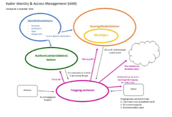
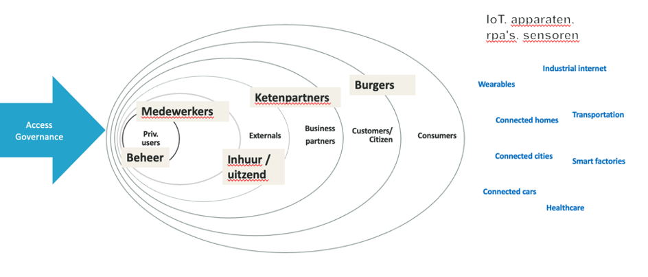
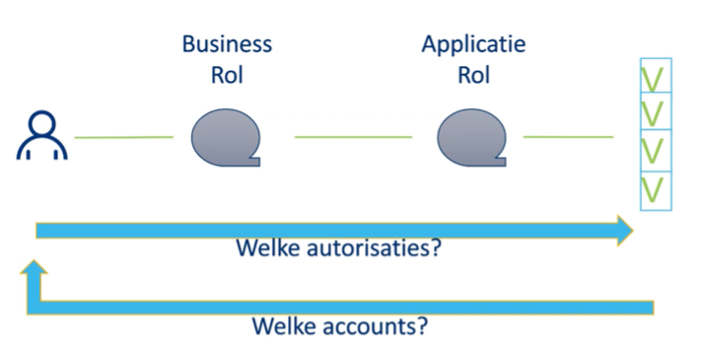
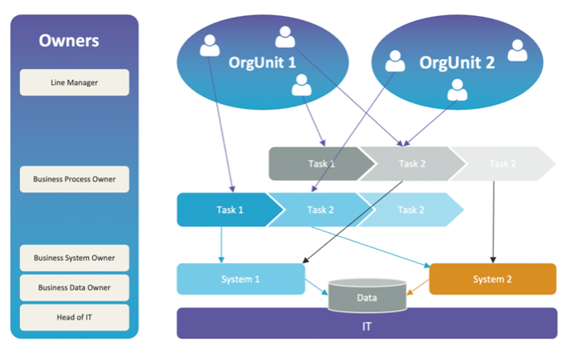
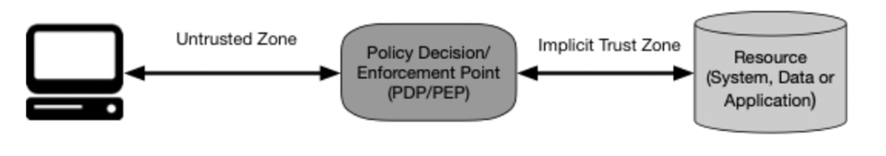
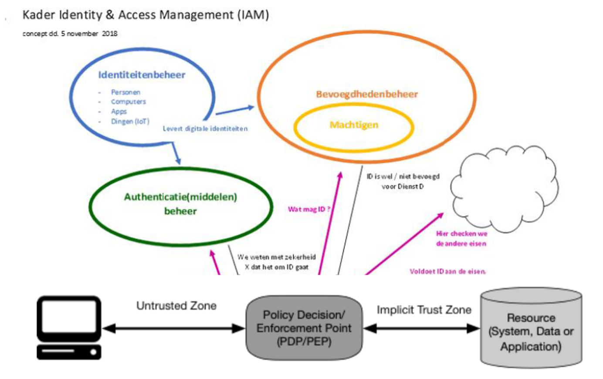
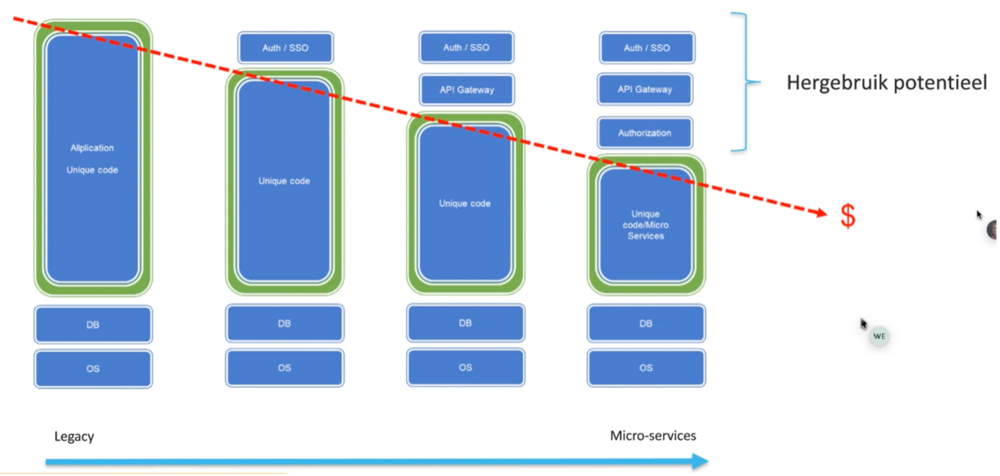

# Achtergrond project Werken met API’s
De wens om te komen tot een referentiearchitectuur rondom het werken met API’s is ontstaan vanuit de realisatie dat de huidige manier waarop veel gemeenten hun identiteiten en toegangsbeheer hebben ingericht niet voldoet in een informatievoorziening die is gebaseerd op een API-landschap. 

## Referentiemodel NORA
Onderstaand figuur geeft de referentiearchitectuur van de NORA weer op het gebied van identity en access management. Het is een belangrijke referentiearchitectuur die we binnen het Werken met API’s project als basis voor een nadere uitwerking gebruiken.

Wat we in de bovenstaande identity en access management referentiearchitectuur onderscheiden is dat Identity management (identiteitenbeheer) en Access management (toegangsbeheer) twee verschillende begrippen zijn. Identiteitenbeheer bestaat uit het beheer van identiteiten enerzijds en de middelen waarmee een identiteit kan worden aangetoond. Identiteitenbeheer gaat over inhuur, instroom, doorstroom en uitstroom van medewerkers en de identiteiten van derde- en federatieve partijen. Het gaat dus identiteiten die toegang verleend kunnen worden. Via een authenticatiemiddel toon je met een bepaalde zekerheid aan dat je ook daadwerkelijk degene bent waarvan je zegt dat je het bent.

Waarom een identiteit toegang krijgt wordt vastgelegd in het toegangsbeheer. Het toegangsbeheer bestaat in bovenstaande referentiearchitectuur uit het beheer van bevoegdheden en machtigingen.

Bovenstaande referentiearchitectuur geeft weer dat deze twee verschillende domeinen bepalend zijn of iemand toegang krijgt.  Om iemand toegang te verlenen tot een dienst of resource is een betrouwbare identiteit nodig in combinatie met de een toegangsbevoegdheid die vastgesteld wordt op basis van toegangsregels. Pas als aan beide voorwaarden is voldaan, dus een geauthentiseerde identiteit die voldoed aan de toegangsregels wordt toegang verleend.

## Identiteitenbeheer 
Identiteitenbeheer en toegangsbeheer zijn verschillende vakgebieden die een onderlinge relatie kennen maar afzonderlijk beschouwd en behandeld kunnen worden. Het onderscheid tussen identiteiten- en toegangsbeheer is relevant als we het hebben over moderne technologieën rondom API’s. 

Identiteitenbeheer en toegangsbeheer is een breed vakgebied wat veel verschillende domeinen raakt. Onderstaand figuur illustreert dit. Hierbij valt op te merken dat de omvang van de ellipsen in het figuur ook aangeven wat de omvang van de populatie is die toegang verleend wordt. 

Het gaat vanaf privileged users en speciale admin en root omgevingen waar beherende entiteiten mee werken naar business-to-employee waaronder instroom-, uitstroom-, en doorstroom van medewerkers valt. Het gaat hierbij om entiteiten die binnen een organisatie werkzaam zijn en die binnen de organisatie toegang mogen hebben tot bepaalde resources. De volgende domeinen zijn overheid naar overheid (oftewel samenwerking tussen ketenpartijen) en overheid naar burgers. Voor ieder domein geldt dat op een specifieke manier gebruikers geïdentificeerd moeten worden en toegang moet worden verleend op basis van toegangsregels. Helemaal rechts in het figuur wordt weergegeven dat ook IoT devices toegang verleend kan worden. Het gaat hier dus om devices, componenten, rpa’s, robots en dergelijke. Deze IoT devices bevatten vaak sensoren die gegevens en signalen afleveren en ook zij hebben dus toegang nodig. Uiteraard moeten ook deze IoT-devices beheerd worden.

Per domein is de herkomst van identiteiten verschillend. Bij de privileged access en IoT domeinen is met name change management een driver. Bij toevoeging van een nieuwe componenten of servers ontstaat in die domeinen de noodzaak om nieuwe beheeraccounts aan te maken terwijl in het business-to-employee domein met name HR-processen (instroom, uitstroom en doorstroom processen) invloed hebben op gebruikersaccounts. In het domein van overheid naar burgers is selfservice een ontwikkeling waarbij burgers hun eigen identiteit kunnen beheren. Het vakgebied identity en access management is dus heel divers als het gaat om identiteiten. Voor al de identiteiten moeten we op dezelfde manier kijken naar toegang. Kernvraag van de informatiebeveiliging is: wie mag wat, en waarom? De wie vraag is hierboven geadresseerd. Waarom iemand iets mag dat wordt bepaald door Access Governance.

### Toegangsbeheer
Om toegangsbeheer te duiden en aan te geven wat de knelpunten zijn bij de inrichting die nu veelal binnen organisaties wordt gebruikt wordt een voorbeeld uitgewerkt. Dit voorbeeld is gebaseerd op het gebruik van een Identity Governance and Administration (IGA) oplossing. Een IGA-oplossing beheert digitale identiteiten en toegangsrechten over meerdere systemen binnen een organisatie. 

In bovenstaand model stromen medewerkers in via HR-processen vanuit het HR-systeem. De IGA-oplossing krijgt mutaties vanuit het HR-systeem door en administreert onder andere bij welke afdeling medewerkers behoren, welke taken zij gaan uitvoeren, wie de verantwoordelijk manager is en wat de rol van een medewerker binnen de organisatie is. Op grond van hiervan wordt vervolgens een account aangemaakt in een informatiesysteem, Active Directory of Cloudvoorziening. In dit geschetste basis IGA-model wordt het Role Based Access Control (RBAC) model gehanteerd. 

Binnen het RBAC-model wordt iemand binnen de organisatie bekend als identiteit en krijgt hij of zijn niet afzonderlijke persoonlijke autorisaties maar autorisaties die op basis van een rol, of rollen, toegekend worden. Het RBAC-model kent zijn mogelijkheden maar ook zijn beperkingen. Het grote voordeel van dit model is dat het autorisatiebeheer door slim gebruik te maken van rollen grotendeels geautomatiseerd worden. Stel iemand komt in dienst en wordt krijgt als rol ‘medewerker financiën’. Op basis van deze rol kunnen aan de persoon autorisaties worden toegekend voor bijvoorbeeld folders op een server van de afdeling financiën, toegang tot het financieel systeem en misschien ook wel autorisaties voor functies in de Cloud. De medewerker kan dus op basis van een roltoekenning direct met de juiste autorisaties aan de slag. Op het moment dat de medewerker de organisatie verlaat kunnen de autorisaties ook automatisch worden ingetrokken op basis van een uitstroom bericht vanuit het HR-systeem. Het RBAC-model is het meest basale en bekende model van identity en access management. Kern van het model is dat het gaat over automatiseren van uitgifte van autorisaties. Onderstaand figuur geeft de basis van het model weer.

Een persoon krijgt een bepaalde business rol, bijvoorbeeld ‘debiteurenbeheerder’. Op basis van die rol krijgt iemand toegang tot een applicatierol. Deze applicatierol is een verzameling autorisaties in een informatiesysteem.  In het geval dat de applicatierol ‘debiteurenmedewerker’ binnen het financieel systeem wordt gekoppeld aan de business rol ‘debiteurenbeheerder’ dan krijgt de persoon links in het figuur automatisch alle autorisaties rechts in het figuur. Van een persoon kan ook bepaald worden welke autorisaties deze toegekend heeft gekregen door te kijken welke business rol(len) de persoon heeft en deze te combineren met de autorisaties in de applicatierol(len). Ook kan in dit model vanuit een specifieke autorisatie bepaald worden welke accounts toegang hebben tot een bepaalde autorisatie door te bepalen in welke applicatierol de autorisatie is opgenomen, welke bedrijfsrol(len) gekoppeld zijn aan de applicatierol en welke accounts aan de bedrijfsrol gekoppeld zijn. Qua beheer en efficiency is RBAC een handig model wat mede door gemeenten op grote schaal wordt toegepast.

Aan het RBAC-model kleven naast voordelen ook een aantal knelpunten. Het eerste knelpunt is geneste rollen en groepen. Denk hierbij bijvoorbeeld aan groepen die lid zijn van een andere groep. Het zicht op de autorisaties raakt door deze nesting snel verloren. De vraag wie mag wat, en waarom iemand iets mag is bij het nesten van rollen al snel onduidelijk. Het is bijvoorbeeld goed mogelijk dat iemand vanuit verschillende toegekende rollen dezelfde autorisatie heeft. Bij het gebruik van de autorisatie is dan niet te herleiden vanuit welke specifieke rol iemand handelt. Het is wel bekend dat de persoon een autorisatie heeft, maar waarom diegene de autorisatie gebruikt is onduidelijk. 
Een ander nadeel van RBAC is dat in de loop van de tijd veel rollen ontstaan, rollen qua inhoud statisch zijn en de nesting van deze rollen vaak in het verloop van de tijd onduidelijk is. Hierdoor is het overzicht van autorisaties niet helder is het dus ook lastig om iemand een bepaalde autorisatie te ontnemen. Een account kan immers vanuit verschillende rollen een autorisatie verkrijgen. Zonder helder overzicht van rollen en onderlinge groepering van rollen is het grip krijgen op autorisaties en daarmee in control zijn van toegang tot functies en resources lastig. Dit is dus een governance probleem. Een ander governance issue bij het RBAC-model is het toepassen van functiescheiding. Functiescheiding is een manier om taken, bevoegdheden en verantwoordelijkheden van elkaar te scheiden zodat ze niet in één hand liggen. Functiescheiding is feitelijk een risicomanagement methodiek om fraude, misbruik en fouten bij het uitvoeren van processen te voorkomen. Op het moment dat iemand een rol krijgt, en rollen ook genest worden is het lastig om vast te stellen of iemand de juiste autorisaties heeft en niet ook taken kan uitvoeren die vanuit functiescheiding ongewenst zijn. Onderdeel van functiescheiding is daarnaast ook het voorkomen van belangenverstrengeling. Op het moment dat bij het uitvoeren van een taak niet eenduidig vast te stellen is voor welk doel een autorisatie gebruikt wordt is het voorkomen van belangenverstrengeling lastig.
Een laatste belangrijke beperking van RBAC is het ontbreken van context bij autorisaties. Stel dat een medewerker bij de belastingdienst de rol heeft van medewerker voor het afhandelen van aanvragen voor toeslagen. Stel dat alle medewerkers binnen deze rol hebben dezelfde autorisaties, ervaring en competenties hebben en iedere medewerker binnen de rol alle soorten toeslagaanvragen mag afhandelen. Daarnaast is het zo dat een medewerker niet zijn eigen aanvraag voor een toeslag mag afhandelen. In dat geval is de context (een eigen aanvraag) dus bepalend voor de toegang. Het RBAC-model voorziet niet in deze contextbeperking. Dus als bijvoorbeeld iemand alleen onder kantooruren mag werken, of alleen vanaf een bepaalde locatie voorziet het RBAC-model niet in deze context beperking.

Het RBAC-model is vanuit beheeroogpunt ideaal maar het levert vanuit governance oogpunt dus helaas niet de controle en governance die gewenst is. Als het RBAC-model gehanteerd wordt moet er dus iets worden toegevoegd om die controle rondom de context wel te verkrijgen. Om dit vraagstuk op te lossen is onderstaand Access Governance model ontwikkeld.

In bovenstaand model wordt het verlenen van toegang opgedeeld in vijf lagen waarbij elke laag een eigen aandachtsgebied kent. Dit model moet niet verward worden met de Common Ground vijf lagen maar kent wel raakvlakken met dit model.

Het Access Governance model onderscheidt een vijftal types eigenaren binnen een organisatie die elk vanuit hun eigen verantwoordelijkheden iets mogen vinden van toegang. Ieder mag binnen hun eigen domein bepalen wie om welke reden toegang krijgt tot een proces, dienst, systeem of resource:

•	Een lijnmanager mag bepalen welke medewerker een bepaalde taak mag uitvoeren. De lijnmanager bepaald bijvoorbeeld ook of een bepaalde taak past binnen de competenties van de medewerker. Ook bepaald de manager of een taak nog binnen de tijdsbesteding van een medewerker past;
•	De proceseigenaar gaat over de processenkwaliteit en de uitvoering van processen. Voor de proceseigenaar is het niet van belang wie een proces uitvoert. Vanuit verantwoording is wel van belang dat te herleiden is wie een proces heeft uitgevoerd, maar of een medewerker een proces mag uitvoeren valt buiten de verantwoordelijkheid van de proceseigenaar. De proceseigenaar heeft wel de bevoegdheid om te bepalen wanneer iemand een taak mag uitvoeren. Een proceseigenaar kan bijvoorbeeld eisen dat een medewerker een bepaalde vastgestelde kwalificatie heeft zoals een rijbevoegdheid van een bepaalde categorie of een bepaalde certificering. Het gaat daarbij dus om vereiste aantoonbare competenties. De proceseigenaar is degene die de risico’s binnen een proces inschat. Bijvoorbeeld risico’s op fraude of misbruik van gegevens. De proceseigenaar is dus verantwoordelijk voor het borgen van functiescheiding daar waar dat vereist is. Een proceseigenaar zal daarom processen opdelen in processtappen die afzonderlijk te autoriseren zijn om misbruik en fouten te voorkomen;
•	De systeemeigenaar is verantwoordelijk voor een informatiesysteem, hetzij on-premise of als houder van een SLA met een clouddienst of SaaS leverancier. De systeemeigenaar is verantwoordelijk voor de systeemautorisaties en de mapping daarvan op taken, verantwoordelijkheden en bevoegdheden van medewerkers;
•	De gegevenseigenaar is verantwoordelijk voor de data governance. Hieronder vallen verantwoordelijkheden ten aanzien van duurzame toegankelijkheid en compliance aan wet- en regelgeving. Hieronder valt ook doelbinding voor gebruik van gegevens door processen in het kader van de AVG;
•	De laatste stakeholder ten aanzien van toegang is het hoofd IT. Het hoofd IT gaat over toegang tot de infrastructuur. Dus krijgt iemand toegang tot het netwerk of aan welke voorwaarden moet dan voldaan worden. Denk aan verplichte configuraties van software op laptops, firewalls, VPN’s, patch levels en dergelijke.

Alle vijf de types eigenaren hebben op hun aandachtsgebied iets te zeggen over toegang. Allen zijn verantwoordelijk voor een stukje van de toegangsregels (access policy) die gelden. Iedere eigenaar vult een deel van de waarom vraag in ten aanzien van het vraagstuk van wie krijgt waarom toegang? 

## Federatie van identiteiten
Een gemeente is verantwoordelijk voor het beheer van de identiteiten van de medewerkers van de eigen organisatie. Dit beheer betreft de inhuur, instroom, doorstroom en uitstroom processen en daaraan voortvloeiende IT-voorzieningen zoals een Active Directory en Windows. De gemeente heeft in de HR-processen geborgd dat de medewerker is wie hij zegt dat hij is en de organisatie heeft een inschatting gemaakt van de risico’s die de organisatie loopt door bijvoorbeeld een Verklaring Onbesproken Gedrag (VOG) te eisen. Voor identiteiten van buiten de eigen organisatie ligt het beheer idealiter gezien ook buiten de organisatie. Een voorbeeld is hierbij de identificatie van burgers via DigiDn of eIDAS. De uitvoering van de processen rondom het herkennen en erkennen van de identiteit van burgers ligt hierbij bij de overheid. Gemeenten kunnen voor het identificeren van burgers gebruik maken van deze gefedereerde DigiD identiteit. Gemeenten vertrouwen er daarbij op dat de overheid de processen rondom de identiteiten op orde heeft en betrouwbare identiteiten levert. Op basis van dit vertrouwen geeft de gemeente vervolgens op basis van eigen toegangsregels deze gefedereerde identiteiten toegang. De gemeente kent de personen achter de identiteiten niet maar geeft ze op basis van het vertrouwen van de identity provider (in dit geval de overheid) toegang. Het identiteitenbeheer (identiteiten en authenticatiemiddelen) ligt dus bij de overheid terwijl het toegangsbeheer de verantwoordelijkheid van de gemeente is. 

Welke identity providers worden vertrouwd als betrouwbare providers is bij het gebruik van gefedereerde identiteiten de verantwoordelijkheid van de organisatie die diensten aanbied. In de commerciële sector worden bijvoorbeeld partijen als Google, Facebook en Apple veel gebruikt als identity providers. Binnen de overheid zijn de providers die gebruikt mogen worden gelimiteerd vanuit wetgeving. De Wet digitale overheid (Wdo) beschrijft de eisen die gesteld worden aan identity providers die in het publieke domein gebruikt mogen worden. Tot op heden zijn dit DigiD, eHerkenning en eIDAS. In de toekomst ontstaat ook de mogelijkheid voor private partijen (zoals IRMA en Itsme) om als identity provider voor de overheidsdiensten op te treden.

## Zero Trust concept
Het zero trust concept is beschreven in de NIST 800-207. In dit model wordt een verzoek tot toegang tot een resource gevalideerd door een Policy Enforcement Point (PEP). Dit component borgt dat van ieder verzoek wat wordt gedaan op basis van toegangsregels wordt bepaald of de identiteit die het verzoek doet toegang mag krijgen tot de resource. Het maakt hierbij niet uit of de identiteit een lokale- of een gefedereerde identiteit is. De bepaling of aan de toegangsregels voldaan wordt is de verantwoordelijkheid van een Policy Decision Point (PDP). Het PEP biedt een aantal attributen, waaronder de identiteit en het type identity provider, aan het PDP aan. Het PDP zal op basis van deze attributen de toegangsregels uitvoeren en het resultaat terugkoppelen aan het PEP. Het PEP geeft op basis van die uitkomst wel of geen toegang tot de resource.

De toegangsregels worden via een Policy Administration Point (PAP) beschreven en vastgelegd. Het PDP heeft de mogelijkheid om naast de attributen die van het PEP ontvangen worden op basis van toegangsregels nog andere attributen op te vragen bij informatiesystemen. Het kan dit zelf doen of het kan hiervoor een Policy Information Point (PIP) gebruiken. Onderstaand figuur geeft de verschillende onderdelen weer die een rol spelen in het zero trust model.

## Projectie van Zero Trust concept op NORA referentiemodel 
Als de concepten van het zero trust model worden geprojecteerd op de NORA referentiearchitectuur op het gebied van identity en access management dan ontstaat onderstaand beeld. Het onderdeel ‘Toegang verlenen’ van het model wordt ingevuld door een policy enforcement en een policy decision point. Het beheer van de bevoegdheden kan in dit model worden uitgevoerd met behulp van een policy administration point. In de evealuatie van de toegangsrechten kan gebruik worden gemaakt van de attributen die van de identity provider ontvangen worden. Deze attributen zullen bij gebruik van de voor de overheid toegestane middelen onder andere de identiteit, het type authenticatiemiddel en het betrouwbaarheidsniveau van het middel zijn.

Door toepassing van het bovenstaande model ontstaat een dynamiek die bij toegangsverlening op het gebied van toegekende rollen (RBAC) ontbreekt. Door gebruik te maken van attributen en policies is toegangsverlening op basis van context mogelijk gemaakt. Het is mogelijk om in de afweging van toegangsverlening attributen mee te nemen als de tijd van de dag of de locatie van waar de identiteit is aangemeld. Ook is het mogelijk om bijvoorbeeld het BSN, OIN of intern HR-id van de aangemelde identiteit in een toegangsregel mee te nemen. Hierdoor wordt het bijvoorbeeld mogelijk om te borgen dat een medewerker een bepaalde transactie enkel mag afhandelen als de medewerker zelf niet betrokken is als belanghebbende binnen de transactie. Een medewerker mag bijvoorbeeld geen vergunningsaanvraag afhandelen waarvoor hij of zij zelf de aanvrager is.

## Transitie van toegangsverlening in informatiesystemen
Informatiesystemen zijn het laatste decennium ten aanzien van identiteiten- en toegangsbeheer geëvolueerd. Daar waar een tiental jaar geleden veel systemen het identiteitenbeheer en het toegangsbeheer geheel binnen het informatiesysteem afhandelden zijn veel van de huidige systemen geschikt voor het gebruik van een externe identity provider zoals een Active Directory (AD). Door het identiteitenbeheer uit de informatiesystemen te halen is single sign-on (SSO) mogelijk gemaakt. Een gebruiker meldt eenmaal aan bij een AD en kan vervolgens zonder opnieuw aan te melden verschillende applicaties opstarten. De applicaties ontvangen bij het opstarten de identiteit van de gebruiker en baseren daarop de toegangsrechten. Dat laatste wordt meestal op basis van 
rolgebaseerde toegang gedaan. De applicaties stellen in dit geval de rollen vast die de gebruiker in de AD toegewezen heeft gekregen en delen aan de hand daarvan autorisaties aan gebruikers toe voor applicatiefuncties. 

In de volgende evolutie van informatiesystemen die momenteel plaats aan het vinden is wordt de toegang tot applicaties (APIs) geregeld via een API-gateway. In deze situatie wordt door de applicatie zelf nog steeds de autorisatie uitgevoerd. De API-gateway kan bepalen of een identiteit de API mag aanroepen maar de API zelf bevat nog toegangsregels die (nader) bepalen of de functie door de identiteit uitgevoerd mag worden. Een laatste stap die in de komende jaren genomen zal worden is het verwijderen van de toegangsregels uit de APIs en het centraal definiëren en afdwingen van deze regels. 

Bovenstaand model geeft de evolutie aan die informatiesystemen doorlopen vanuit de ‘oude’ legacy applicaties naar applicaties die gebaseerd zijn op (micro)services. Het model wat in de huidige ontwikkeling van informatiesystemen het meest wordt toegepast is het derde model van links. Het model uiterst rechts is het model waar vanuit de GEMMA referentiearchitectuur naar wordt gestreefd. In dit model zijn identiteiten federatief en worden toegangsregels centraal bijgehouden en uitgevoerd. De diensten (APIs) voeren in dit model zelf geen autorisatieregels meer uit en kennen geen identiteiten. 

Naast de inrichting van voorzieningen als een PEP, PDP en PAP binnen de gemeentelijke informatievoorziening en de aanpassing van bestaande informatiesystemen vraagt het zero trust model ook om maatregelen op het gebied van netwerkinfrastructuur. Het is bijvoorbeeld vereist dat de toegang tot APIs afgeschermd wordt van de buitenwereld. De APIs bevatten in de doelsituatie geen kennis meer van identiteiten en toegangsrechten en misbruik van deze APIs is zonder de juiste beveiligingsmaatregelen, zoals segmentatie van netwerken, een risico.
